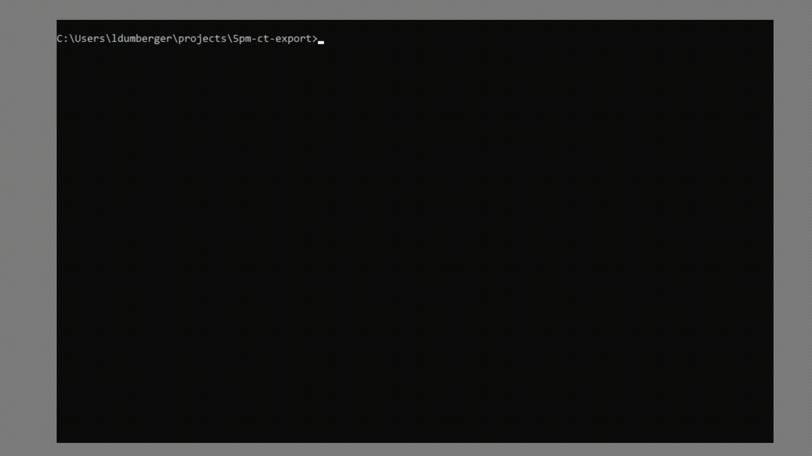
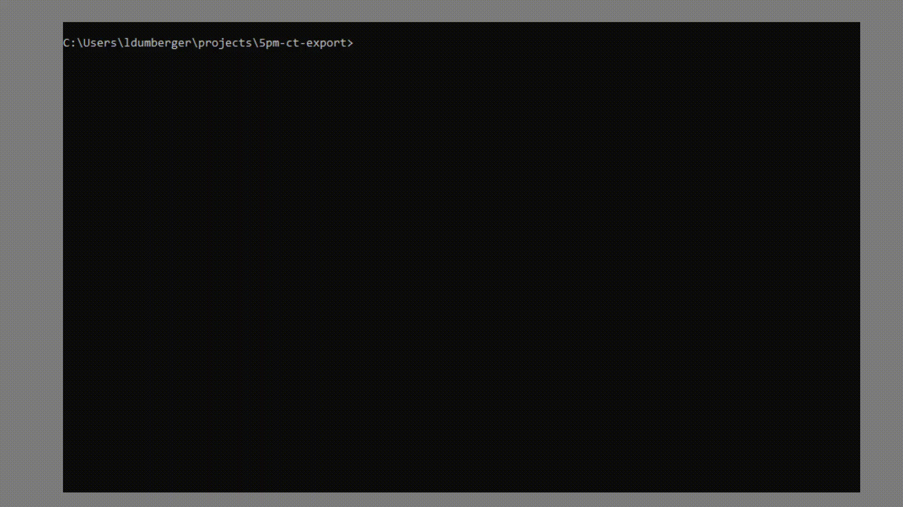
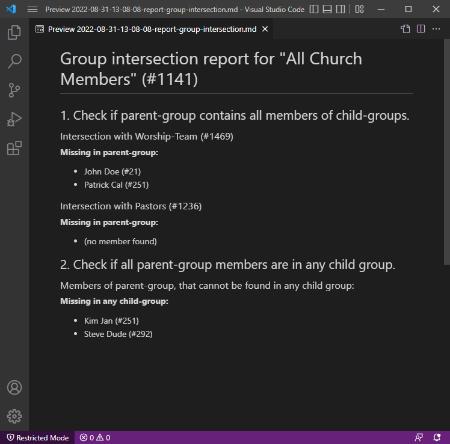
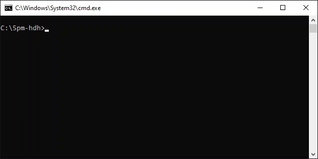

# ChurchTools CLI-Tool

## Demo - Export Songs to Excel

This Demo shows how to export all songs from ChurchTools with the CLI-Tool:


## Prerequisites

To use this CLI-Tool you need to install PHP 8.0 on your System.

- Tutorial: [Install PHP on Windows](https://www.w3resource.com/php/installation/install-php-on-windows.php)
- Tutorial: [Install PHP on Mac](https://daily-dev-tips.com/posts/installing-php-on-your-mac/)

## Usage / Installation

**Option 1: Download phar**

Download the packed phar executable: [ct.phar](https://github.com/5pm-HDH/churchtools-cli/raw/main/dist/ct.phar)

Execute the phar from your bash/cmd and e.q. list all available commands:

```bash
php ct.phar list
```

**Option 2: Clone this repo**

Clone this repo and execute the CLI from your bash/cmd and e.q. with this command to print all available commands:

```bash
php ct list
```

## Setup

Before you can retrieve data from ChurchTools, you must set up the configuration. Call this command:

```bash
php ct.phar settings:setup
```



### Show data

Retrieve date from ChurchTools with the `show`-commands. For example show all available calendars:



Other available commands:

- `show:api-token`
- `show:calendars`
- `show:services`
- `show:groups`
- `show:resources`
- `show:bookings`
- `show:events`
- `show:songs`
- `show:group-members`

**Options:**

- `--help` get additional context
- `--export` export the displayed table to an excel file
- `--export-json` export the displayed table to an json-file
- `--export-json-objects` export the displayed models as raw json-objects to an json-file
- `--add-template=[TEMPLATE_NAME]` create template from command (see section [Templates](#templates))

### Export data

Export data to excel files with the `export`-commands. For example the `export:song-usage`-command:


**Options:**

- `--help` get additional context
- `--add-template=[TEMPLATE_NAME]` create template from command (see section [Templates](#templates))

#### Export Song-Usage

```bash
php ct.phar export:song-usage 42 --start_date=2019-02-01 --end_date=2020-04-01
```

Export Usage of songs of all events that are created in the calendar with the id 42. You can optional add start- /
end-date flags.

#### Export Service-Person

```bash
php ct.phar export:service-person 42 12,13,14 --start_date=2019-02-01 --end_date=2020-04-01
```

Export the services of all events that are created in the calendar with the id 42. You can optional add start- /
end-date flags.

### Templates

Templates are useful to store frequently executed commands. With the option `--add-template=[TEMPLATE-NAME]` you can
store the command with all arguments and options to a template:


With the `template:list` command you can display all stored templates. To execute a template simply call `template:run`
with the template-name as argument.

- `template:list` list all stored export-template
- `tepmlate:run` run a stored export-template
- `template:delete` delete a stored export-template
- `template:clear` deletes all templates

### Report

Reports generate Markdown files as output. There is currently one report available:

#### Report group-intersection

This reports needs two arguments:

- parent-group-id
- children-group-ids (as comma-seperated list)

The report processes all child-groups and checks if all members of a child-group are also member of the parent group.
Also it checks is all members of a parent group are in at least one child-group.


The output of the report can look like this:



### Settings

You can list, update and edit the settings:



- `settings:clear` remove all settings
- `settings:list` list all available settings
- `settings:setup` setup settings interactive