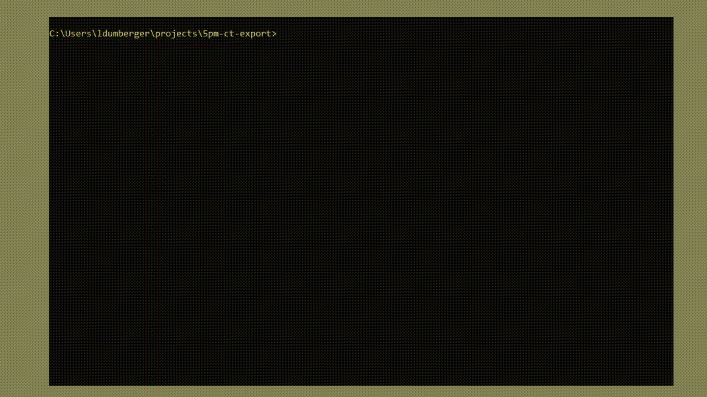
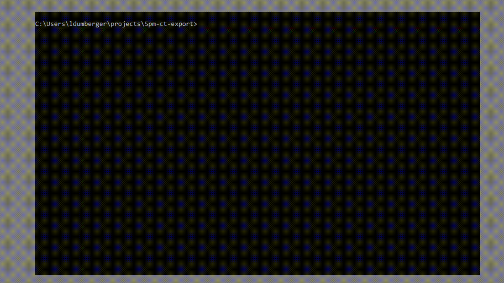

# ChurchTools CLI-Tool

## Usage

**Option 1: Download phar**

Download the packed phar executable: [/dist/ct.phar](https://github.com/5pm-HDH/churchtools-cli/raw/main/dist/ct.phar)

Execute the phar from your bash/cmd and e.q. list all available commands:

```bash
php ct.phar list
```


**Option 2: Clone this repo**

Clone this repo and execute open the CLI with this command to print all available commands:

```bash
php ct list
```

Before you can retrieve date from ChurchTools, you must set up the setting. Call this command:

```bash
php ct.phar settings:setup
```


### Show data

Retrieve date from ChurchTools with the `show`-commands:

- `php ct.phar show:api-token` displays the api-token
- `php ct.phar show:calendars` displays a list of calendars 
- `php ct.phar show:services` displays all services


### Export data

Export data to excel files with the `export`-commands.



#### Export Song-Usage

```bash
php ct.phar export:song-usage 42 --start_date=2019-02-01 --end_date=2020-04-01
```

Export Usage of songs of all events that are created in the calendar with the id 42. You can optinal add start- / end-date flags.

After the export succeeded you can store the used configuration in a ExportTemplate. The export templates can be accesses with the `template-commands`

### Templates

- `template:list` list all stored export-template
- `tepmlate:run` run a stored export-template
- `template:delete` delete a stored export-template

