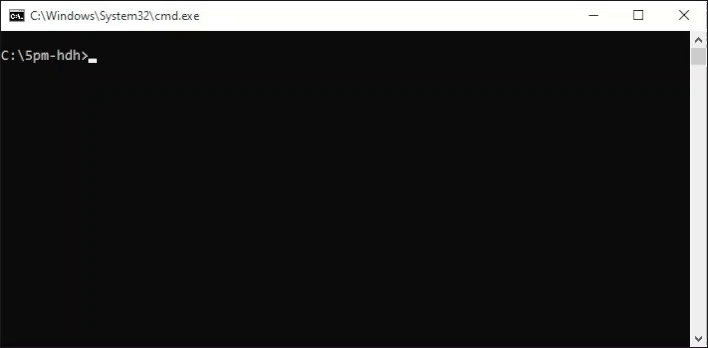

# ChurchTools CLI-Tool

## Usage

Clone this repo and execute open the CLI with this command to print all available commands:

```bash
php cli list
```

Before you can retrieve date from ChurchTools, you must set up the setting. Call this command:

```bash
php cli settings:setup
```


### Show data

Retrieve date from ChurchTools with the `show`-commands:

- `php cli show:api-token` displays the api-token
- `php cli show:calendars` displays a list of calendars 
- `php cli show:services` displays all services



### Export data

Export data to excel files with the `export`-commands.


#### Export Song-Usage

```bash
php cli export:song-usage 42 --start_date=2019-02-01 --end_date=2020-04-01
```

Export Usage of songs of all events that are created in the calendar with the id 42. You can optinal add start- / end-date flags.

After the export succeeded you can store the used configuration in a ExportTemplate. The export templates can be accesses with the `template-commands`

### Templates

- `template:list` list all stored export-template
- `tepmlate:run` run a stored export-template
- `template:delete` delete a stored export-template

