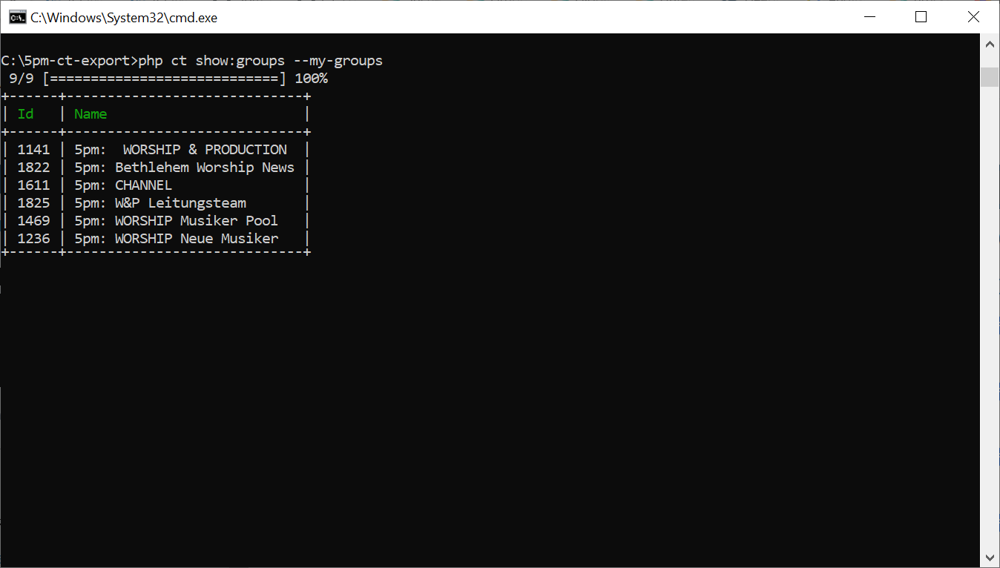
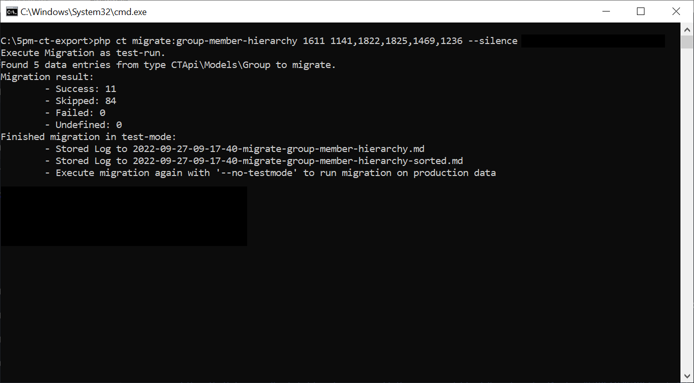

# Migration von Gruppenmitgliedern

Es bleibt eine ständige Frage im ChurchTools-Forum: [Warum werden die Teilnehmer einer Gruppe nicht mit der Gruppenhierarchie vererbt](https://forum.church.tools/topic/6963/gruppenmitglieder-automatisch-in-%C3%BCbergeordnete-gruppen-einf%C3%BCgen/9)? Und dafür gibt es sehr gute Gründe!

Allerdings gibt es manche fälle in denen es schon geschickt wäre, wenn eine Gruppe die Mitglieder mehrere anderen Gruppen zusammenfassen würden. Nur ein [Beispiel aus dem ChurchTools Forum.](https://forum.church.tools/topic/8808/untergeordnete-gruppen-im-chat?_=1664277637704)

**Background aus unserer Gemeinde:** Wir haben für den Gottesdienst verschiedene Dienste, die sich jeweils in eigenen Gruppen (auch Chat-Gruppen) organisieren. Den Event-Chat nutzen wir um den Gottesdienst zu organisieren. Trotzdem brauchen wir eine Chat-Gruppe in der wir News an alle Gottesdienstmitarbeiter schicken. Damit wir diese "große Chat-Gruppe" mit allen anderen Gruppen synchronisiert halten nutzen wir das selbst entwickelte ChurchTools-CLI Tool.

**Tipp:** Wenn du bisher noch nicht mit dem CT-CLI (ChurchTools CLI-Tool) gearbeitet hast, lohnt es sich vielleicht kurz
die wichtigsten Informationen und Abläufe auf der [README.md](../../README.md) Seite nachzulesen.

#### 1. Gruppen IDs herausfinden

Um die Migration zu starten, müssen die Ids der Gruppen herausgefunden werden. Das gelingt z.B. über den Befehl: `php ct.phar show:groups --my-groups`



Die Mitglieder aller 5pm-Gruppen sollen in der "5pm: CHANNEL" Gruppe zusammengefasst werden. In dieser Gruppe ist der "große" Chat aktiv. 

#### 2. Migration im Testmodus ausführen

Mit den IDs lässt sich jetzt die Migration ausführen:



Das erste Argument "1611" ist die Eltern-Gruppe. Also die Gruppe, die alle Mitglieder der Kind-Gruppen enthalten soll. Die Kind-Gruppen werden kommasepariert aufgeführt: "1141,1822,1825,1469,1236". Zur verbesserten Übersicht wird mit der Option `--silence` verhindert, das das Log auch in der Konsole angezeigt wird. 

Alle Migrationen werden per Default im "Test-Modus" aufgeführt. Das bedeutet die Daten werden nicht wirklich geändert. Um die Migration später auf den produktiven Daten auszuführen, muss die Option `--no-testmode` angehängt werden. 

Doch bevor die Migration tatsächlich auf den Livedaten ausgeführt wird ist es sinnvoll das Log zu überprüfen. Hier ein Auszug aus dem `2020-09-27-09-17-40-migrate-group-member-hierarchy-sorted.md`-LogFile:

```md
# Migration result in test-mode:

 - Undefined: 0
 - Success: 11
 - Skipped: 84
 - Failed: 0

# Log:

 - SKIPPED: Person is already in parent-group. [CTApi\Models\Person (#1322; Luke Smith)]
// weitere Einträge...
 - SUCCESS: Successfully added person to parent-group. [CTApi\Models\Person (#1301; John Smith)]
// weitere Einträge...
```

Nach kurzer Durchsicht des Log-Files scheint die Migration zu funktionieren und kann auf den Live-Daten ausgeführt werden:

```bash
php ct.phar migrate:group-member-hierarchy 1611 1141,1822,1825,1469,1236 --silence --no-testmode
```

**Optional - Anlegen eins Templates:** Alternativ kann auch ein [Template](./../../README.md#33-templates) für die Migration angelegt werden über die Option `--add-template=Migrate5PMChat`. Das angelegte Template enthält den ausgeführten Befehl und alle Argumente und Optionen. Jetzt kann einfach das Template aufgerufen werden ohne jedes Mal den ganzen Befehl im Kopf oder einer Textdatei abspeichern zu müssen:

```bash
php ct.phar template:run Migrate5PMChat
```


#### 3. Automatische Ausführung mittels Cron-Job

Damit die Migration der Daten nicht bei jeder Änderung manuell ausführen muss, nutze ich den Cronjob-Manager auf meinem Webserver. Dazu lade ich die phar-datei des CLI-Tool auf den Server, authentifiziere mich mit meinem ChurchTools-Nutzer (`php ct.phar settings:setup`) und füge den Migrationsbefehl als Cronjob hinzu:

```txt
@hourly cd /usr/home/usrname/5pm-cli/ && /usr/bin/php ct.phar migrate:group-member-hierarchy 1611 1141,1822,1825,1469,1236 --silence --no-testmode >> /dev/null 2>&1
```

Oder wenn ein Template für den Befehl angelegt wurde:

```txt
@hourly cd /usr/home/usrname/5pm-cli/ && /usr/bin/php ct.phar template:run Migrate5PMChat >> /dev/null 2>&1
```


Dadurch wird die Migration stündlich ausgeführt und ich muss mich um das Hinzufügen neuer Mitglieder in der Chatgruppe nicht mehr kümmern.