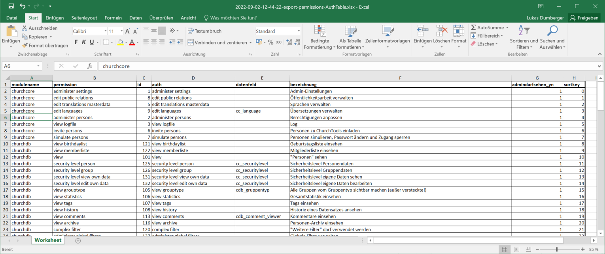
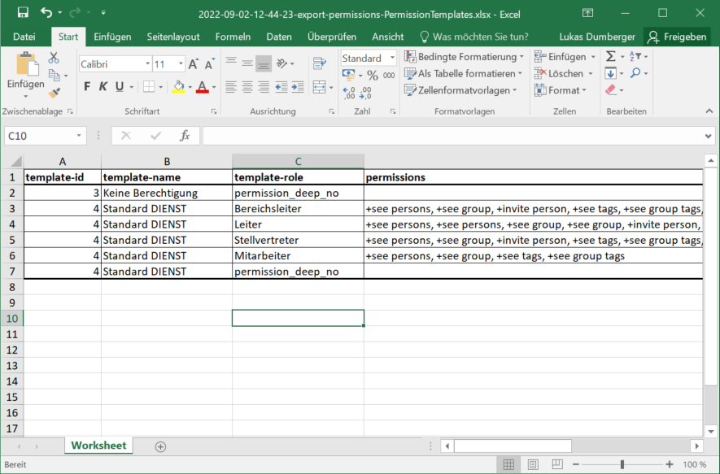
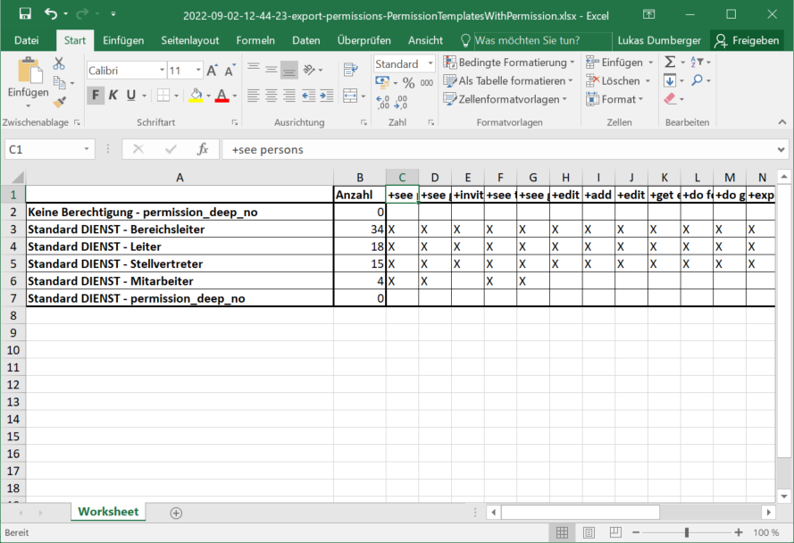

# Permissions

Export Permissions with command `php ct export:permissions`. The raw json-response is stored direct to the `export-permissions-raw-output.json`. This output will be also processed to the following excel-exports:

**AuthTable**

Contains all available rights:

**TemplateTable**

Contains all permission templates:

**TemplateTable**

Contains all permission template but with optimized display of the permissions.

